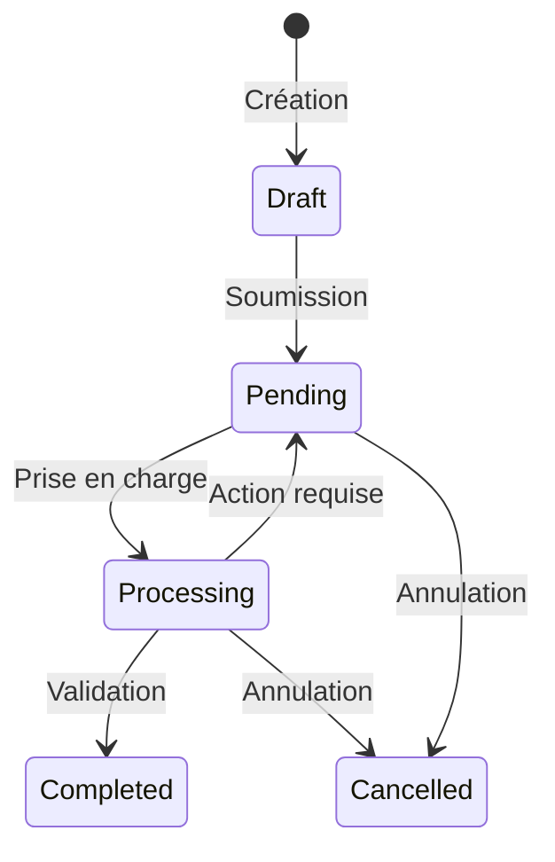
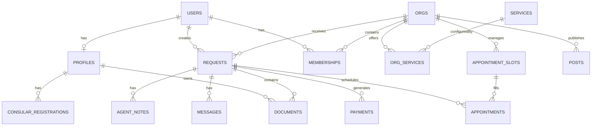

# 📋 Cahier des Charges

## Portail Consulat du Gabon

**Version:** 1.0  
**Date:** Février 2026  
**Projet:** Consulat.ga - Plateforme de Services Consulaires Digitaux

---

## 1. Présentation du Projet

### 1.1 Contexte

Le projet **Consulat.ga** est une plateforme SaaS de digitalisation des services consulaires du Gabon. Elle permet aux citoyens gabonais résidant à l'étranger d'accéder aux services administratifs consulaires de manière dématérialisée.

### 1.2 Objectifs

- Dématérialiser les démarches administratives consulaires
- Réduire les délais de traitement des demandes
- Améliorer l'expérience usager pour les citoyens à l'étranger
- Centraliser la gestion multi-organisations (consulats, ambassades)
- Permettre le suivi en temps réel des demandes

---

## 2. Stack Technique

### 2.1 Frontend

| Technologie         | Usage                             |
| ------------------- | --------------------------------- |
| **React 18**        | Framework UI                      |
| **TanStack Router** | Routage file-based                |
| **TanStack Query**  | Gestion du cache et data fetching |
| **Tailwind CSS**    | Styling utilitaire                |
| **Shadcn/ui**       | Composants UI                     |
| **Clerk**           | Authentification                  |

### 2.2 Backend

| Technologie       | Usage                                           |
| ----------------- | ----------------------------------------------- |
| **Convex**        | Base de données temps réel & backend serverless |
| **Stripe**        | Paiements en ligne                              |
| **Resend**        | Emails transactionnels                          |
| **Google Gemini** | IA pour analyse automatique des demandes        |
| **Cloudinary**    | Stockage médias (optionnel)                     |

### 2.3 Déploiement

- **Hébergement:** Netlify / Google Cloud Run
- **CI/CD:** GitHub Actions → déploiement automatique sur `main`

---

## 3. Architecture Fonctionnelle

### 3.1 Types d'Utilisateurs

| Rôle            | Description                       | Accès                |
| --------------- | --------------------------------- | -------------------- |
| **Citoyen**     | Usager des services consulaires   | `/my-space/*`        |
| **Agent**       | Personnel consulaire              | `/admin/*`           |
| **Admin Org**   | Administrateur d'une organisation | `/admin/*` (complet) |
| **Super Admin** | Administrateur global             | `/dashboard/*`       |

### 3.2 Types d'Organisations

```typescript
OrganizationType = {
  Embassy: "embassy", // Ambassade
  Consulate: "consulate", // Consulat
  GeneralConsulate: "general_consulate", // Consulat Général
  HonoraryConsulate: "honorary_consulate", // Consulat Honoraire
  ThirdParty: "third_party", // Partenaire tiers
};
```

---

## 4. Modules Fonctionnels

### 4.1 Module Profil Citoyen

**Schéma de données:** `profiles`

#### Données collectées

| Section        | Champs                                                  |
| -------------- | ------------------------------------------------------- |
| **Identité**   | Nom, Prénom, Date/Lieu de naissance, Nationalité, Genre |
| **Passeport**  | Numéro, Dates émission/expiration, Autorité émettrice   |
| **Adresses**   | Résidence actuelle, Adresse au pays d'origine           |
| **Contacts**   | Téléphone, Email, Contacts d'urgence (2)                |
| **Famille**    | Statut marital, Parents (père/mère), Conjoint           |
| **Profession** | Statut professionnel, Poste, Employeur                  |

#### Fonctionnalités

- [x] Complétion progressive du profil
- [x] Score de complétude (`completionScore`)
- [x] Stockage des documents d'identité permanents
- [x] Carte consulaire numérique

---

### 4.2 Module Inscription Consulaire

**Schéma de données:** `consularRegistrations`

#### Types d'inscription

| Type           | Description                      |
| -------------- | -------------------------------- |
| `inscription`  | Première inscription au registre |
| `renewal`      | Renouvellement de l'inscription  |
| `modification` | Modification des données         |

#### Durées d'inscription

| Durée       | Description                                              |
| ----------- | -------------------------------------------------------- |
| `temporary` | Séjour temporaire                                        |
| `permanent` | Résidence permanente (ouvre droit à la carte consulaire) |

#### Statuts

| Statut      | Description         |
| ----------- | ------------------- |
| `requested` | Demande en cours    |
| `active`    | Inscription active  |
| `expired`   | Inscription expirée |

#### Carte Consulaire

- Numéro au format: `[CC][YY][DDMMYY]-[NNNNN]`
- Validité: 5 ans par défaut
- Impression via application **EasyCard** (intégration native macOS)

---

### 4.3 Module Catalogue de Services

**Schémas:** `services` (catalogue global) + `orgServices` (configuration par organisation)

#### Catégories de Services

| Catégorie          | Code              | Exemples                           |
| ------------------ | ----------------- | ---------------------------------- |
| 🛂 Passeport       | `passport`        | Nouveau passeport, Renouvellement  |
| 🪪 Identité        | `identity`        | Carte d'identité, Carte consulaire |
| 📜 État Civil      | `civil_status`    | Acte de naissance, Mariage         |
| ✈️ Visa            | `visa`            | Visa court séjour, Long séjour     |
| ✅ Certification   | `certification`   | Légalisation, Apostille            |
| 📋 Immatriculation | `registration`    | Inscription consulaire             |
| 🆘 Assistance      | `assistance`      | Aide d'urgence                     |
| 📄 Laissez-passer  | `travel_document` | Document de voyage d'urgence       |
| 🔄 Transcription   | `transcript`      | Transcription d'actes étrangers    |
| 📦 Autre           | `other`           | Services divers                    |

#### Configuration par Organisation

- Tarification personnalisée (`pricing`)
- Délais de traitement spécifiques
- Instructions locales
- Activation/désactivation des services
- Formulaires personnalisés (`formSchema`)

---

### 4.4 Module Demandes (Requests)

**Schéma:** `requests`

#### Workflow des Demandes



#### Statuts

| Statut       | Description              |
| ------------ | ------------------------ |
| `draft`      | Brouillon non soumis     |
| `pending`    | En attente de traitement |
| `processing` | En cours de traitement   |
| `completed`  | Demande finalisée        |
| `cancelled`  | Demande annulée          |

#### Priorités

| Priorité   | Description         |
| ---------- | ------------------- |
| `normal`   | Traitement standard |
| `urgent`   | Traitement accéléré |
| `critical` | Urgence absolue     |

#### Actions Requises

Le système permet aux agents de demander des compléments au citoyen:

| Type                   | Description                        |
| ---------------------- | ---------------------------------- |
| `upload_document`      | Téléverser un document manquant    |
| `complete_info`        | Compléter des champs du formulaire |
| `schedule_appointment` | Prendre rendez-vous                |
| `make_payment`         | Effectuer un paiement              |
| `confirm_info`         | Confirmer des informations         |

---

### 4.5 Module Documents

**Schéma:** `documents`

#### Types de Documents Supportés

- Passeport
- Justificatif de domicile
- Photo d'identité
- Acte de naissance
- Preuve de résidence
- Documents spécifiques aux services

#### Statuts de Validation

| Statut      | Description              |
| ----------- | ------------------------ |
| `pending`   | En attente de validation |
| `validated` | Document validé          |
| `rejected`  | Document refusé          |
| `expired`   | Document expiré          |
| `expiring`  | Document bientôt expiré  |

#### Propriétaires (Polymorphisme)

- `profile` - Documents permanents du profil
- `request` - Documents liés à une demande
- `user` - Documents système
- `organization` - Documents de l'organisation

---

### 4.6 Module Rendez-vous

**Schémas:** `appointmentSlots` + `appointments`

#### Créneaux Horaires (Slots)

- Configuration par organisation
- Capacité par créneau
- Blocage pour jours fériés/absences
- Association optionnelle à un service spécifique

#### Rendez-vous

| Statut        | Description          |
| ------------- | -------------------- |
| `confirmed`   | Rendez-vous confirmé |
| `cancelled`   | Annulé               |
| `completed`   | Effectué             |
| `no_show`     | Non présenté         |
| `rescheduled` | Reporté              |

#### Fonctionnalités

- Rappels automatiques par email (J-1)
- Lien avec la demande de service
- Notes et motifs d'annulation

---

### 4.7 Module Paiements

**Schéma:** `payments`

#### Intégration Stripe

- PaymentIntent pour les paiements en ligne
- Sessions de checkout sécurisées
- Gestion des remboursements

#### Statuts

| Statut       | Description |
| ------------ | ----------- |
| `pending`    | En attente  |
| `processing` | En cours    |
| `succeeded`  | Réussi      |
| `failed`     | Échoué      |
| `refunded`   | Remboursé   |
| `cancelled`  | Annulé      |

---

### 4.8 Module Notifications

**Intégration:** Resend (emails transactionnels)

#### Templates Email

| Type                  | Déclencheur                        |
| --------------------- | ---------------------------------- |
| Nouveau message       | Message d'un agent sur une demande |
| Mise à jour statut    | Changement de statut de demande    |
| Rappel RDV            | J-1 avant le rendez-vous           |
| Confirmation paiement | Paiement réussi                    |
| Action requise        | Agent demande un complément        |
| Demande finalisée     | Traitement terminé                 |

---

### 4.9 Module Intelligence Artificielle

**Intégration:** Google Gemini

#### Analyse Automatique des Demandes

À la soumission d'une demande, l'IA effectue:

- **Vérification de complétude** des documents
- **Validation des données** du formulaire
- **Détection d'anomalies** potentielles
- **Suggestion d'actions** à l'agent

#### Types d'Analyse

| Type              | Description                    |
| ----------------- | ------------------------------ |
| `completeness`    | Vérification de la complétude  |
| `document_check`  | Analyse des documents fournis  |
| `data_validation` | Validation des données saisies |

#### Résultat d'Analyse

```typescript
interface AnalysisResult {
  status: "complete" | "incomplete" | "review_needed";
  documentAnalysis: {
    matched: string[]; // Documents trouvés
    missing: string[]; // Documents manquants
    suspicious: string[]; // Documents suspects
  };
  formAnalysis: {
    missingFields: string[]; // Champs vides obligatoires
    invalidValues: string[]; // Valeurs invalides
  };
  summary: string; // Résumé lisible
  confidence: number; // Score de confiance (0-1)
  suggestedAction: "upload_document" | "complete_info" | "confirm_info" | null;
}
```

---

### 4.10 Module Formulaires Dynamiques

**Système:** FormBuilder avec schéma JSON

#### Structure des Formulaires

```typescript
interface FormSchema {
  sections: FormSection[]; // Sections du formulaire
  joinedDocuments?: FormDocument[]; // Documents requis
  showRecap?: boolean; // Afficher récapitulatif
}

interface FormSection {
  id: string;
  title: LocalizedString;
  fields: FormField[];
  optional?: boolean;
  conditions?: FormCondition[]; // Affichage conditionnel
}
```

#### Types de Champs

| Type              | Description           |
| ----------------- | --------------------- |
| `text`            | Texte libre           |
| `email`           | Email avec validation |
| `phone`           | Numéro de téléphone   |
| `number`          | Valeur numérique      |
| `date`            | Date                  |
| `select`          | Liste déroulante      |
| `checkbox`        | Case à cocher         |
| `textarea`        | Zone de texte longue  |
| `file`            | Upload de fichier     |
| `country`         | Sélecteur de pays     |
| `gender`          | Sélecteur de genre    |
| `address`         | Adresse complète      |
| `image`           | Upload d'image        |
| `profileDocument` | Document du profil    |

#### Logique Conditionnelle

Les champs et sections peuvent être affichés conditionnellement selon:

- Valeur d'un autre champ
- Opérateurs: `equals`, `notEquals`, `contains`, `isEmpty`, `isNotEmpty`, `greaterThan`, `lessThan`
- Logique combinée: `AND` / `OR`

---

### 4.11 Module Publications (Posts)

**Schéma:** `posts`

#### Catégories

| Catégorie      | Usage                |
| -------------- | -------------------- |
| `news`         | Actualités           |
| `event`        | Événements           |
| `announcement` | Annonces officielles |
| `other`        | Divers               |

#### Statuts

| Statut      | Description |
| ----------- | ----------- |
| `draft`     | Brouillon   |
| `published` | Publié      |
| `archived`  | Archivé     |

---

### 4.12 Module Messagerie

**Schémas:** `conversations` + `messages`

- Conversations liées aux demandes
- Échange entre citoyens et agents
- Notifications email automatiques

---

## 5. Interfaces Utilisateur

### 5.1 Espace Citoyen (`/my-space/*`)

| Page                   | Route                      | Description                    |
| ---------------------- | -------------------------- | ------------------------------ |
| Tableau de bord        | `/my-space`                | Vue d'ensemble, widgets, stats |
| Mon profil             | `/my-space/profile`        | Données personnelles complètes |
| Inscription consulaire | `/my-space/registration`   | Processus d'immatriculation    |
| Mes demandes           | `/my-space/requests`       | Liste et détail des demandes   |
| Mes documents          | `/my-space/documents`      | Documents téléversés           |
| Mes rendez-vous        | `/my-space/appointments/*` | Calendrier et réservations     |
| Notifications          | `/my-space/notifications`  | Centre de notifications        |
| Paramètres             | `/my-space/settings`       | Préférences du compte          |
| Onboarding             | `/my-space/onboarding`     | Parcours d'accueil             |

### 5.2 Espace Agent/Admin (`/admin/*`)

| Page                | Route                        | Description                      |
| ------------------- | ---------------------------- | -------------------------------- |
| Dashboard           | `/admin`                     | Vue d'ensemble de l'organisation |
| Demandes            | `/admin/requests/*`          | Traitement des demandes          |
| Calendrier          | `/admin/calendar`            | Agenda des rendez-vous           |
| RDV                 | `/admin/appointments/*`      | Gestion des créneaux             |
| Registre consulaire | `/admin/consular-registry/*` | Citoyens inscrits                |
| Citoyens            | `/admin/citizens/*`          | Annuaire des usagers             |
| Services            | `/admin/services/*`          | Configuration des services       |
| Publications        | `/admin/posts/*`             | Gestion du contenu               |
| Paiements           | `/admin/payments`            | Suivi financier                  |
| Équipe              | `/admin/team/*`              | Gestion du personnel             |
| Paramètres          | `/admin/settings/*`          | Configuration de l'org           |
| Statistiques        | `/admin/statistics`          | Analytics                        |

### 5.3 Espace Super Admin (`/dashboard/*`)

| Page          | Route                     | Description                     |
| ------------- | ------------------------- | ------------------------------- |
| Dashboard     | `/dashboard`              | Vue globale multi-organisations |
| Organisations | `/dashboard/orgs/*`       | Gestion des consulats           |
| Utilisateurs  | `/dashboard/users/*`      | Gestion des utilisateurs        |
| Services      | `/dashboard/services/*`   | Catalogue global                |
| Demandes      | `/dashboard/requests/*`   | Vue transversale                |
| Publications  | `/dashboard/posts/*`      | Publications globales           |
| Logs d'audit  | `/dashboard/audit-logs/*` | Traçabilité                     |
| Paramètres    | `/dashboard/settings/*`   | Configuration globale           |

### 5.4 Pages Publiques

| Page             | Route               | Description                   |
| ---------------- | ------------------- | ----------------------------- |
| Accueil          | `/`                 | Landing page                  |
| Services         | `/services/*`       | Catalogue public              |
| Actualités       | `/news/*`           | Blog/actualités               |
| Organisations    | `/orgs/*`           | Annuaire des consulats        |
| Formulaires      | `/formulaires`      | Téléchargement de formulaires |
| Tarifs           | `/tarifs`           | Grille tarifaire              |
| FAQ              | `/faq`              | Questions fréquentes          |
| Accessibilité    | `/accessibilite`    | Déclaration d'accessibilité   |
| Mentions légales | `/mentions-legales` | Informations légales          |
| Confidentialité  | `/confidentialite`  | Politique de confidentialité  |
| Vérification     | `/verify/$token`    | Vérification de document      |

---

## 6. Modèle de Données

### 6.1 Schéma Relationnel



### 6.2 Tables

| Table                   | Description                           |
| ----------------------- | ------------------------------------- |
| `users`                 | Utilisateurs (lié à Clerk)            |
| `profiles`              | Données consulaires citoyens          |
| `orgs`                  | Organisations (consulats, ambassades) |
| `memberships`           | Appartenance users ↔ orgs             |
| `services`              | Catalogue global de services          |
| `orgServices`           | Configuration services par org        |
| `requests`              | Demandes de services                  |
| `documents`             | Fichiers téléversés                   |
| `consularRegistrations` | Inscriptions consulaires              |
| `appointments`          | Rendez-vous                           |
| `appointmentSlots`      | Créneaux disponibles                  |
| `payments`              | Transactions Stripe                   |
| `posts`                 | Publications                          |
| `conversations`         | Fils de discussion                    |
| `messages`              | Messages individuels                  |
| `documentTemplates`     | Modèles de documents                  |
| `formTemplates`         | Modèles de formulaires                |
| `documentVerifications` | Vérifications de documents            |
| `agentNotes`            | Notes internes (IA + agents)          |
| `events`                | Journal d'activité                    |

---

## 7. Internationalisation

### 7.1 Langues Supportées

- 🇫🇷 Français (principal)
- 🇬🇧 Anglais

### 7.2 Contenus Localisés

Tous les contenus éditoriaux utilisent le type `LocalizedString`:

```typescript
type LocalizedString = {
  fr: string;
  en: string;
};
```

---

## 8. Sécurité

### 8.1 Authentification

- **Provider:** Clerk
- SSO social (Google, etc.)
- MFA disponible
- Sessions sécurisées JWT

### 8.2 Autorisation

| Niveau  | Mécanisme                                   |
| ------- | ------------------------------------------- |
| API     | Queries/Mutations authentifiées Convex      |
| Routes  | Guards TanStack Router                      |
| Données | Filtrage par `orgId` et `userId`            |
| Rôles   | `admin`, `agent`, `viewer` par organisation |

### 8.3 Protection des Données

- Stockage chiffré (Convex)
- Soft delete pour traçabilité
- Logs d'audit

---

## 9. Intégrations Externes

| Service           | Usage             | Statut   |
| ----------------- | ----------------- | -------- |
| **Clerk**         | Authentification  | ✅ Actif |
| **Convex**        | Backend/DB        | ✅ Actif |
| **Stripe**        | Paiements         | ✅ Actif |
| **Resend**        | Emails            | ✅ Actif |
| **Google Gemini** | IA                | ✅ Actif |
| **EasyCard**      | Impression cartes | ✅ Actif |

---

## 10. Planification & Maintenance

### 10.1 Tâches Planifiées (Crons)

| Tâche                  | Fréquence | Description                       |
| ---------------------- | --------- | --------------------------------- |
| `statsRefresh`         | Quotidien | Recalcul des statistiques par org |
| `appointmentReminders` | Quotidien | Envoi des rappels de RDV          |

### 10.2 Migrations

Le répertoire `convex/migrations/` contient les scripts de migration de données.

---

## 11. Livrables

### 11.1 Application Web

- Portail citoyen responsive
- Console d'administration
- Dashboard super-admin

### 11.2 Application Native

- **EasyCard** (macOS) - Impression des cartes consulaires via Evolis Primacy 2

### 11.3 Documentation

- Cahier des charges (ce document)
- Documentation API Convex (auto-générée)
- Guide utilisateur (à produire)

---

## 12. Évolutions Futures

> [!TIP]
> Fonctionnalités identifiées pour les versions futures:

| Priorité   | Fonctionnalité       | Description                            |
| ---------- | -------------------- | -------------------------------------- |
| 🔴 Haute   | Associations         | Gestion des associations gabonaises    |
| 🔴 Haute   | Profils enfants      | Ajout de mineurs au profil familial    |
| 🟡 Moyenne | Annuaire compétences | Répertoire des professionnels gabonais |
| 🟡 Moyenne | Prédictions IA       | Analyse prédictive des flux            |
| 🟢 Basse   | Application mobile   | Version iOS/Android                    |
| 🟢 Basse   | Chatbot IA           | Assistant virtuel citoyen              |

---

## Annexes

### A. Codes Pays

Le système utilise les codes ISO 3166-1 alpha-2 pour tous les pays.
Pays principal: `GA` (Gabon)

### B. Devises

Devise par défaut: `EUR`
Format: centimes (ex: 3500 = 35,00€)

### C. Fuseaux Horaires

Configurables par organisation.
Défaut: `Europe/Paris`

---

_Document généré automatiquement à partir de l'analyse du code source._
