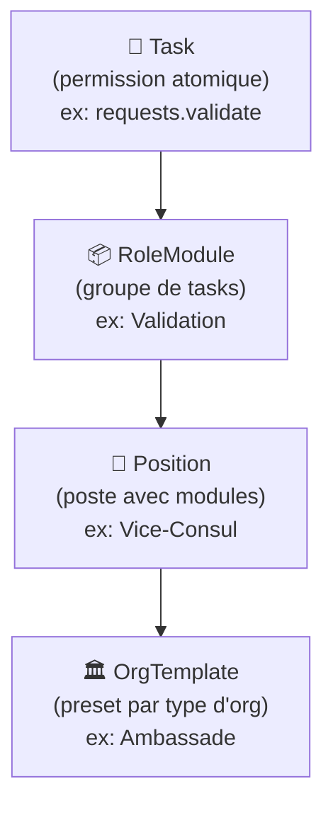

# 🔍 Analyse des Écarts — Consulat.ga vs Consulat-Corbis

> Comparaison exhaustive entre notre projet (`consulat.ga`) et le projet de référence (`consulat-ga-core-bis`) de ton collègue.
> Focus : **logique métier**, gestion des consulats, agents, hiérarchie, et permissions.

---

## Vue d'ensemble

| Dimension          | Notre projet | Référence (Corbis) | Écart                    |
| ------------------ | ------------ | ------------------ | ------------------------ |
| Tables schema      | 36           | 57                 | **21 tables manquantes** |
| Fichiers functions | 40           | 43                 | 3 fichiers manquants     |
| Fichiers lib       | 14           | 16                 | 2 fichiers manquants     |
| Fichiers schemas   | 36           | 41                 | 5 fichiers manquants     |

---

## 🔴 Priorité Critique — Système de Rôles & Postes

C'est **le plus gros écart**. Corbis a un système complet de gestion des postes consulaires avec modules de permissions, là où nous n'avons qu'un système basique.

### Ce que nous avons

Notre système actuel repose sur :

- Un champ `role` dans `memberships` (admin/agent/viewer)
- Un champ `diplomaticRole` optionnel (string libre)
- Une table `permissions` dynamique (grant/deny par membership)
- Un fichier [permissions.ts](file:///Users/berny/Developer/consulat.ga/convex/lib/permissions.ts) avec des listes de rôles hardcodées

### Ce que Corbis a en plus

#### 1. Architecture Task → RoleModule → Position → Template

#### 2. Catalogue de 38 permissions atomiques (TASK_CATALOG)

Organisé en 12 catégories métier :

| Catégorie       | Permissions | Exemples                                                  |
| --------------- | ----------- | --------------------------------------------------------- |
| `requests`      | 7           | view, create, process, validate, assign, delete, complete |
| `documents`     | 4           | view, validate, generate, delete                          |
| `appointments`  | 3           | view, manage, configure                                   |
| `profiles`      | 2           | view, manage                                              |
| `civil_status`  | 3           | transcribe, register, certify                             |
| `passports`     | 3           | process, biometric, deliver                               |
| `visas`         | 3           | process, approve, stamp                                   |
| `finance`       | 3           | view, collect, manage                                     |
| `communication` | 2           | publish, notify                                           |
| `team`          | 3           | view, manage, assign_roles                                |
| `settings`      | 2           | view, manage                                              |
| `analytics`     | 2           | view, export                                              |
| `intelligence`  | 2           | view, manage                                              |

> [!IMPORTANT]
> Nous n'avons **aucune** de ces permissions métier spécifiques (état civil, passeports, visas, renseignement). Notre système ne différencie pas les types d'actions consulaires.

#### 3. 13 Modules de Rôle par défaut

Chaque module groupe des permissions pour un profil métier :

| Module               | Description                    | Icône |
| -------------------- | ------------------------------ | ----- |
| `direction`          | Supervision générale, pilotage | 👑    |
| `management`         | Coordination, gestion d'équipe | 📋    |
| `request_processing` | Traitement des demandes        | 📝    |
| `validation`         | Validation & approbation       | ✅    |
| `civil_status`       | État civil complet             | 📜    |
| `passports`          | Passeports & biométrie         | 🛂    |
| `visas`              | Instruction & délivrance visas | 🔖    |
| `finance`            | Comptabilité & encaissement    | 💰    |
| `communication`      | Publications & annonces        | 📢    |
| `reception`          | Accueil & orientation public   | 🤝    |
| `consultation`       | Lecture seule                  | 👁️    |
| `intelligence`       | Renseignement & sécurité       | 🔒    |
| `system_admin`       | Administration technique       | ⚙️    |

#### 4. Système de Grades hiérarchiques

| Grade       | Label                        | Niveau |
| ----------- | ---------------------------- | ------ |
| `chief`     | Chef de mission diplomatique | 1      |
| `counselor` | Conseiller                   | 2      |
| `agent`     | Agent                        | 3      |
| `external`  | Externe (sous contrat)       | 4      |

#### 5. Groupes Ministériels (rattachement administratif)

Templates pour **Ambassades** (7 groupes : Présidence, MAE, Finances, Trésor, Budget, Défense, Intérieur) et **Consulats** (2 groupes : MAE, Finances).

#### 6. Templates de Positions par type d'organisation

Templates complets pour :

- **Ambassade** : Ambassadeur, Premier Conseiller, Chancelier, etc.
- **Consulat Général** : Consul Général, Vice-Consul, etc.
- Chaque position a des `roleModules` assignés, un `grade`, un `ministryCode`

---

### Tables manquantes (Rôles & Postes)

| Table            | Description                              | Schéma                                                                                                            |
| ---------------- | ---------------------------------------- | ----------------------------------------------------------------------------------------------------------------- |
| `roleModules`    | Groupes de permissions configurables     | [roleConfig.ts](file:///Users/berny/Developer/consulat.ga/docs/consulat-ga-core-bis/convex/schemas/roleConfig.ts) |
| `positions`      | Postes au sein d'une organisation        | [roleConfig.ts](file:///Users/berny/Developer/consulat.ga/docs/consulat-ga-core-bis/convex/schemas/roleConfig.ts) |
| `orgRoleConfig`  | Config rôles par org (snapshot template) | [roleConfig.ts](file:///Users/berny/Developer/consulat.ga/docs/consulat-ga-core-bis/convex/schemas/roleConfig.ts) |
| `ministryGroups` | Sous-groupes ministériels                | [roleConfig.ts](file:///Users/berny/Developer/consulat.ga/docs/consulat-ga-core-bis/convex/schemas/roleConfig.ts) |

### Fonctions manquantes

[roleConfig.ts](file:///Users/berny/Developer/consulat.ga/docs/consulat-ga-core-bis/convex/functions/roleConfig.ts) (858 lignes) :

- `getTaskCatalog` — Catalogue des permissions
- `getOrgTemplates` — Templates d'organisations
- `getSystemRoleModules` — Modules système
- `getOrgRoleModules` — Modules par organisation
- `getOrgPositions` — Postes par organisation
- `listAllPositions` — Tous les postes (superadmin)
- `getOrgRoleConfig` — Config rôles d'une org
- `getOrgFullRoleConfig` — Config complète
- `initializeFromTemplate` — Initialiser depuis un template
- `resetToTemplate` — Réinitialiser au template
- CRUD complet : `createPosition`, `updatePosition`, `deletePosition`, `movePositionLevel`
- CRUD modules : `createRoleModule`, `updateRoleModule`, `deleteRoleModule`
- Ministry groups CRUD

### Fichier lib manquant

[roles.ts](file:///Users/berny/Developer/consulat.ga/docs/consulat-ga-core-bis/convex/lib/roles.ts) (1311 lignes) — Définitions complètes TASK_CATALOG, DEFAULT_ROLE_MODULES, POSITION_GRADES, POSITION_TEMPLATES

---

## 🟠 Priorité Haute — Module Configurator (Super Admin)

### Ce que Corbis a

Un système de modules activables par organisation, géré par le Super Admin.

### Tables manquantes

| Table               | Description                                                           |
| ------------------- | --------------------------------------------------------------------- |
| `moduleDefinitions` | Catalogue global des modules (état civil, e-visa, RDV, comptabilité…) |
| `orgModuleConfigs`  | Activation/configuration par organisation                             |

### Fonctions manquantes

[modules.ts](file:///Users/berny/Developer/consulat.ga/docs/consulat-ga-core-bis/convex/functions/modules.ts) (315 lignes) :

- `listModules` — Liste des modules disponibles
- `getModule` — Détail d'un module
- `createModule` / `updateModule` / `removeModule` — CRUD
- `getOrgModules` — Modules activés pour une org
- `toggleOrgModule` — Activer/désactiver un module
- `configureOrgModule` — Configuration personnalisée

### Impact

Permet au Super Admin de définir quels modules (fonctionnalités) sont disponibles pour chaque consulat. Ex: un consulat honoraire n'a pas besoin du module "Visas".

---

## 🟠 Priorité Haute — Sécurité & Maintenance

### Tables manquantes

| Table               | Description                                                      |
| ------------------- | ---------------------------------------------------------------- |
| `securityPolicies`  | Politiques de sécurité par org (MFA, sessions, IP, mot de passe) |
| `maintenanceConfig` | Mode maintenance global, tâches planifiées                       |

### Fonctions manquantes

[security.ts](file:///Users/berny/Developer/consulat.ga/docs/consulat-ga-core-bis/convex/functions/security.ts) (212 lignes) :

- `listPolicies` / `getPolicyForOrg` / `upsertPolicy` / `removePolicy`
- `getMaintenanceConfig` / `toggleMaintenance` / `updateScheduledTasks`

---

## 🟡 Priorité Moyenne — Diplomatique (champs `orgs`)

### Champs manquants dans notre table `orgs`

Notre schéma `orgs` est identique à Corbis **sauf** pour ces champs :

| Champ                | Description                          |
| -------------------- | ------------------------------------ |
| `shortName`          | Nom court de l'organisation          |
| `headOfMission`      | Nom du chef de mission               |
| `headOfMissionTitle` | Titre (Ambassadeur, Consul Général…) |
| `staffCount`         | Effectif                             |
| `enabledServices`    | Services activés (array de slugs)    |
| `jurisdictionNotes`  | Notes sur la juridiction             |

### Champ manquant dans `memberships`

| Champ             | Description                               |
| ----------------- | ----------------------------------------- |
| `isPublicContact` | Visible dans l'annuaire de contact public |

---

## 🟡 Priorité Moyenne — Système de Communication Interne

### Tables manquantes

| Table              | Description                     |
| ------------------ | ------------------------------- |
| `chatChannels`     | Salons de discussion internes   |
| `chatParticipants` | Participants aux salons         |
| `chatMessages`     | Messages de chat                |
| `callSessions`     | Sessions d'appels (audio/vidéo) |

### Fonctions manquantes

- [chat.ts](file:///Users/berny/Developer/consulat.ga/docs/consulat-ga-core-bis/convex/functions/chat.ts) (24 439 octets) — Messagerie interne complète
- [calls.ts](file:///Users/berny/Developer/consulat.ga/docs/consulat-ga-core-bis/convex/functions/calls.ts) (7 702 octets) — Gestion des appels

---

## 🟡 Priorité Moyenne — Neocortex (Système bio-inspiré)

### Tables manquantes

| Table               | Description                         |
| ------------------- | ----------------------------------- |
| `signaux`           | Bus de signaux (événements système) |
| `historiqueActions` | Historique détaillé des actions     |
| `configSysteme`     | Configuration dynamique             |
| `metriques`         | Métriques système                   |
| `poidsAdaptatifs`   | Poids adaptatifs pour l'IA          |

> [!NOTE]
> Ce système est l'évolution de notre architecture Neocortex existante (`limbique.ts`, `hippocampe.ts`, `prefrontal.ts`, `plasticite.ts`). La différence est que Corbis stocke ces données dans des tables Convex dédiées, alors que nous les avons comme fichiers de logique sans tables.

---

## 🟢 Priorité Basse — Autres écarts

### Tables existantes des deux côtés mais avec des différences

| Table                   | Différence                      |
| ----------------------- | ------------------------------- |
| `consularNotifications` | Nous l'avons, Corbis ne l'a pas |
| `associationClaims`     | Nous l'avons, Corbis ne l'a pas |
| `agentSchedules`        | Nous l'avons, Corbis ne l'a pas |

### Fonctions existantes des deux côtés

| Fichier       | Différence                                                                       |
| ------------- | -------------------------------------------------------------------------------- |
| `jobTypes.ts` | Corbis a un fichier `functions/jobTypes.ts`, nous non (mais table absente aussi) |

### Table `jobTypes`

Présente dans Corbis, pas chez nous — gestion des types de postes dans l'écosystème.

---

## Résumé des actions à prendre

| Priorité    | Action                                                                    | Complexité |
| ----------- | ------------------------------------------------------------------------- | ---------- |
| 🔴 Critique | Implémenter le système Role Modules / Positions / Templates               | Très haute |
| 🔴 Critique | Ajouter `convex/lib/roles.ts` (TASK_CATALOG + modules + templates)        | Haute      |
| 🔴 Critique | Ajouter `convex/functions/roleConfig.ts` (CRUD complet)                   | Haute      |
| 🟠 Haute    | Ajouter le Module Configurator (`moduleDefinitions` + `orgModuleConfigs`) | Moyenne    |
| 🟠 Haute    | Ajouter les Security Policies & Maintenance Config                        | Moyenne    |
| 🟡 Moyenne  | Ajouter les champs diplomatiques à `orgs`                                 | Faible     |
| 🟡 Moyenne  | Ajouter `isPublicContact` à `memberships`                                 | Faible     |
| 🟡 Moyenne  | Chat interne (4 tables + functions)                                       | Haute      |
| 🟡 Moyenne  | Tables Neocortex (5 tables)                                               | Moyenne    |
| 🟢 Basse    | Table `jobTypes` + functions                                              | Faible     |
