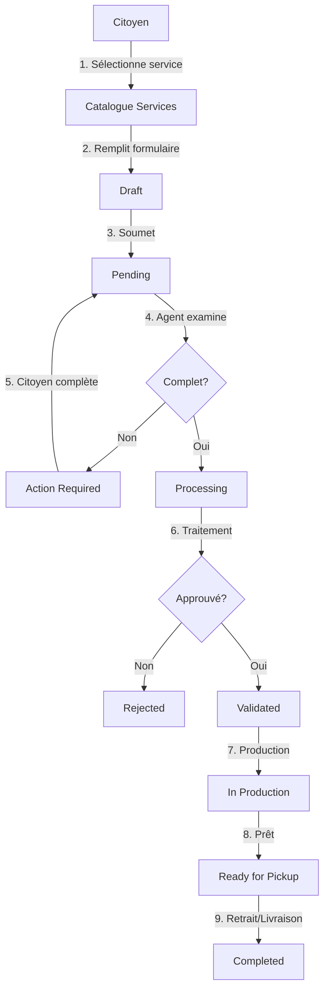
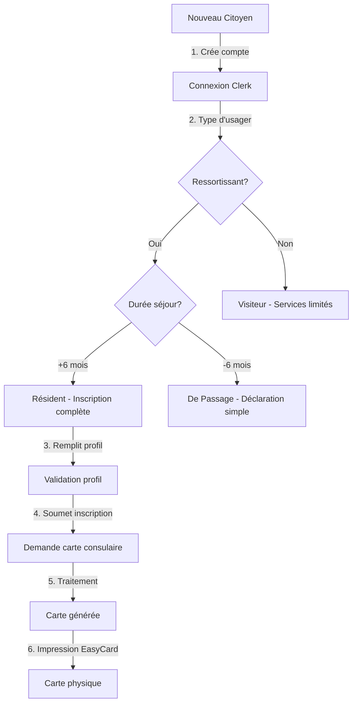
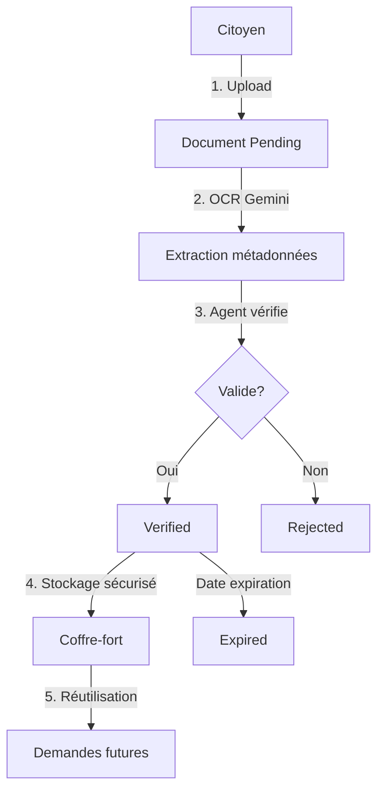
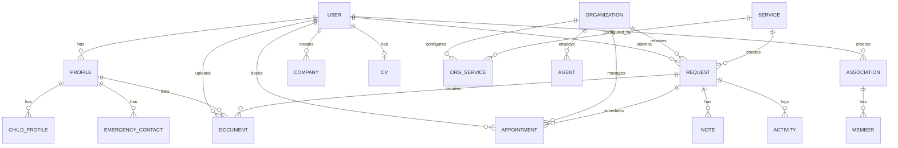

# 🔧 Specifications Techniques - Consulat.ga-Core

**Version:** 2.0  
**Date:** Février 2026  
**Type:** Document Technique

---

## 1. Architecture Système

### 1.1 Vue d'Ensemble

```
┌─────────────────────────────────────────────────────────────┐
│                        FRONTEND                              │
│  React 18 + Vite + TanStack Router + Tailwind + Shadcn/ui   │
└─────────────────────────────┬───────────────────────────────┘
                              │
                              ▼
┌─────────────────────────────────────────────────────────────┐
│                      AUTHENTIFICATION                        │
│                         Clerk                                │
└─────────────────────────────┬───────────────────────────────┘
                              │
                              ▼
┌─────────────────────────────────────────────────────────────┐
│                        BACKEND                               │
│               Supabase (PostgreSQL + Auth)                   │
└───────────────┬────────────────────────────────┬────────────┘
                │                                │
                ▼                                ▼
┌───────────────────────────┐    ┌───────────────────────────┐
│      SERVICES EXTERNES    │    │         STORAGE           │
│  Stripe / Resend / Gemini │    │    Supabase Storage       │
└───────────────────────────┘    └───────────────────────────┘
```

### 1.2 Arborescence du Projet

```
consulat.ga-core/
├── src/
│   ├── App.tsx                 # Point d'entrée application
│   ├── main.tsx                # Bootstrap React
│   ├── index.css               # Styles globaux
│   │
│   ├── components/             # 147 composants UI
│   │   ├── ui/                 # 50 composants Shadcn
│   │   ├── admin/              # Composants admin
│   │   ├── auth/               # Authentification
│   │   ├── cv/                 # CV builder (19 composants)
│   │   ├── dashboard/          # Widgets tableau de bord
│   │   ├── documents/          # Gestion documents
│   │   ├── associations/       # Module associations
│   │   ├── companies/          # Module entreprises
│   │   └── ...
│   │
│   ├── pages/                  # 68 pages
│   │   ├── Home.tsx
│   │   ├── Login.tsx
│   │   ├── dashboard/
│   │   │   ├── CitizenDashboard.tsx
│   │   │   ├── AgentDashboard.tsx
│   │   │   ├── SuperAdminDashboard.tsx
│   │   │   ├── citizen/        # 9 pages citoyen
│   │   │   ├── agent/          # 2 pages agent
│   │   │   ├── admin/          # 3 pages admin org
│   │   │   └── super-admin/    # 5 pages super admin
│   │   ├── services/           # 4 pages services
│   │   ├── associations/       # 3 pages
│   │   ├── companies/          # 3 pages
│   │   └── ...
│   │
│   ├── services/               # 19 services business
│   ├── types/                  # 20+ types TypeScript
│   ├── lib/                    # Utilitaires (constants.ts)
│   ├── hooks/                  # 13 hooks React
│   ├── contexts/               # Contextes React
│   ├── data/                   # Données mock (18 fichiers)
│   ├── schemas/                # Schémas Zod
│   └── i18n/                   # Internationalisation
│
├── supabase/
│   ├── schema.sql              # Schéma base de données
│   ├── migrations/             # Migrations SQL
│   └── functions/              # Edge Functions
│
└── public/                     # Assets statiques
```

---

## 2. Schémas de Types TypeScript

### 2.1 Profile (profil citoyen)

```typescript
interface Profile {
  id: string;
  user_id: string;
  status: ProfileStatus;
  residence_country?: CountryCode;

  consular_card?: {
    cardNumber?: string;
    cardIssuedAt?: number; // Unix timestamp
    cardExpiresAt?: number;
  };

  contacts?: {
    email?: string;
    phone?: string;
    address?: Address;
  };

  personal: {
    firstName: string;
    lastName: string;
    birthDate?: number;
    birthPlace?: string;
    birthCountry?: CountryCode;
    gender?: Gender;
    nationality?: CountryCode;
    acquisitionMode?: NationalityAcquisition;
    passportInfos?: PassportInfo;
    nipCode?: string;
  };

  family?: {
    maritalStatus?: MaritalStatus;
    father?: { firstName?: string; lastName?: string };
    mother?: { firstName?: string; lastName?: string };
    spouse?: { firstName?: string; lastName?: string };
  };

  emergency_contacts?: EmergencyContact[];
  profession_situation?: ProfessionSituation;
  documents?: ProfileDocuments;

  created_at: string;
  updated_at: string;
}
```

### 2.2 ConsularService

```typescript
interface ConsularService {
  id: string;
  code?: string;
  name: string;
  description?: string;
  category?: ServiceCategory;
  status?: ServiceStatus;
  countries?: string[];
  organization_id?: string;
  imageUrl?: string;

  steps?: ServiceStep[];
  processing?: {
    mode: ProcessingMode;
    appointment: { requires: boolean; duration?: number };
    proxy?: { allows: boolean; requirements?: string };
  };
  delivery?: {
    modes: DeliveryMode[];
    appointment?: { requires: boolean };
    proxy?: { allows: boolean };
  };
  pricing?: {
    isFree: boolean;
    price?: number;
    currency?: string;
  };

  legalBasis?: { reference: string; title: string };
  assistanceDetails?: { beneficiaries: string[]; situations: string[] };
}
```

### 2.3 ServiceRequest

```typescript
interface ServiceRequest {
  id: string;
  number?: string;
  service_id: string;
  organization_id: string;
  assigned_agent_id?: string;
  requester_id?: string;
  profile_id: string;

  status: RequestStatus;
  priority?: RequestPriority;
  data?: Record<string, any>;
  document_ids?: string[];

  config?: {
    processingMode: ProcessingMode;
    deliveryMode: DeliveryMode;
    deliveryAddress?: Address;
    proxy?: ProxyInfo;
  };

  delivery?: {
    address: Address;
    trackingNumber: string;
    status: DeliveryStatus;
  };

  generated_documents?: string[];
  notes?: RequestNote[];
  metadata?: RequestMetadata;

  submitted_at?: string;
  completed_at?: string;
  created_at: string;
  updated_at: string;
}
```

### 2.4 VaultDocument

```typescript
interface VaultDocument {
  id: string;
  user_id: string;
  folder_id: DocumentCategory;
  name: string;
  original_name: string | null;
  file_path: string;
  file_type: "pdf" | "image" | "other";
  file_size: number;
  mime_type: string | null;

  source: "upload" | "camera" | "official" | "generated";
  status: "pending" | "verified" | "rejected" | "expired";
  is_verified: boolean;
  verification_date: string | null;
  expiration_date: string | null;

  side?: "front" | "back";
  paired_document_id?: string;
  metadata: Record<string, any>;

  created_at: string;
  updated_at: string;
}
```

### 2.5 Appointment

```typescript
interface Appointment {
  id: string;
  start_time: string;
  end_time: string;
  timezone?: string;
  type?: AppointmentType;
  status: AppointmentStatus;

  organization_id: string;
  service_id?: string;
  request_id?: string;
  profile_id?: string;

  participants?: {
    id: string;
    user_id: string;
    role: ParticipantRole;
    status: ParticipantStatus;
  }[];

  location?: Address;
  actions?: AppointmentAction[];
  notes?: string;
}
```

### 2.6 Association

```typescript
interface Association {
  id: string;
  name: string;
  legalName?: string;
  associationType: AssociationType;
  registrationNumber?: string;
  creationDate?: string;

  status: "PENDING" | "APPROVED" | "REJECTED";
  validatedAt?: string;
  validatedById?: string;
  rejectionReason?: string;

  email: string;
  phone: string;
  website?: string;
  facebook?: string;
  instagram?: string;
  linkedin?: string;

  description: string;
  shortDescription?: string;
  objectives?: string;
  memberCount?: number;
  foundingYear?: number;
  logoUrl?: string;

  address: AddressData;
  ownerId: string;
  ownerRole: AssociationRole;
  members?: AssociationMember[];
}
```

### 2.7 Company

```typescript
interface Company {
  id: string;
  name: string;
  legalName?: string;
  companyType: CompanyType;
  activitySector: ActivitySector;
  siret?: string;
  registrationNumber?: string;

  status: "PENDING" | "APPROVED" | "REJECTED";
  validatedAt?: string;
  validatedById?: string;
  rejectionReason?: string;

  email: string;
  phone: string;
  website?: string;
  description: string;
  shortDescription?: string;
  logoUrl?: string;

  address: AddressData;
  coordinates?: [number, number];
  ownerId: string;
  ownerRole: CompanyRole;
}
```

### 2.8 CV

```typescript
interface CV {
  id: string;
  userId: string;
  firstName: string;
  lastName: string;
  email: string;
  phone: string;
  address: string;
  summary: string;

  experiences: {
    id: string;
    title: string;
    company: string;
    location: string;
    startDate: string;
    endDate?: string;
    current: boolean;
    description: string;
  }[];

  education: {
    id: string;
    degree: string;
    school: string;
    location: string;
    startDate: string;
    endDate?: string;
    current: boolean;
    description?: string;
  }[];

  skills: {
    id: string;
    name: string;
    level: "Beginner" | "Intermediate" | "Advanced" | "Expert";
  }[];

  languages: {
    id: string;
    name: string;
    level: "A1" | "A2" | "B1" | "B2" | "C1" | "C2" | "Native";
  }[];

  hobbies?: string[];
  portfolioUrl?: string;
  linkedinUrl?: string;
}
```

---

## 3. Workflows Métier

### 3.1 Workflow Demande de Service



### 3.2 Workflow Inscription Consulaire



### 3.3 Workflow Gestion Documents



---

## 4. Relations entre Entités



---

## 5. APIs et Endpoints (Services)

### 5.1 Profile Service

```typescript
// profileService.ts
class ProfileService {
  getProfile(userId: string): Promise<Profile>;
  updateProfile(userId: string, data: UpdateProfileDTO): Promise<Profile>;
  calculateCompletionScore(profile: Profile): number;
  validateProfile(profile: Profile): ProfileValidationResult;
}
```

### 5.2 Request Service

```typescript
// requestService.ts
class RequestService {
  createRequest(data: CreateServiceRequestDTO): Promise<ServiceRequest>;
  getRequest(id: string): Promise<ServiceRequest>;
  updateRequest(
    id: string,
    data: UpdateServiceRequestDTO,
  ): Promise<ServiceRequest>;
  submitRequest(id: string): Promise<ServiceRequest>;
  cancelRequest(id: string): Promise<ServiceRequest>;
  assignAgent(requestId: string, agentId: string): Promise<void>;
  addNote(requestId: string, note: RequestNote): Promise<void>;
}
```

### 5.3 Document Service

```typescript
// documentService.ts
class DocumentService {
  uploadDocument(data: DocumentUploadData): Promise<VaultDocument>;
  getDocument(id: string): Promise<VaultDocument>;
  verifyDocument(id: string): Promise<VaultDocument>;
  rejectDocument(id: string, reason: string): Promise<VaultDocument>;
  getDocumentsByFolder(
    userId: string,
    folder: DocumentCategory,
  ): Promise<VaultDocument[]>;
  generatePDF(templateId: string, data: any): Promise<Blob>;
}
```

### 5.4 Appointment Service

```typescript
// appointmentService.ts
class AppointmentService {
  getAvailableSlots(request: AvailabilityRequest): Promise<TimeSlot[]>;
  bookAppointment(data: CreateAppointmentDTO): Promise<Appointment>;
  rescheduleAppointment(
    id: string,
    data: RescheduleAppointmentDTO,
  ): Promise<Appointment>;
  cancelAppointment(id: string, reason?: string): Promise<Appointment>;
  confirmAppointment(id: string): Promise<Appointment>;
}
```

---

## 6. Constantes Système

### 6.1 Enums Principaux

| Enum                | Valeurs                                                                                                   | Usage                   |
| ------------------- | --------------------------------------------------------------------------------------------------------- | ----------------------- |
| `ServiceCategory`   | identity, civil_status, visa, certification, transcript, registration, assistance, travel_document, other | Catégorisation services |
| `RequestStatus`     | pending, draft, submitted, under_review, validated, rejected, completed, cancelled, ...                   | États demande           |
| `DocumentType`      | passport, birth_certificate, identity_card, photo, proof_of_address, ...                                  | Types documents         |
| `AppointmentStatus` | draft, pending, scheduled, confirmed, completed, cancelled, missed, rescheduled                           | États RDV               |
| `UserRole`          | user, agent, admin, super_admin, manager, intel_agent, education_agent                                    | Rôles utilisateurs      |
| `ConsularRole`      | CONSUL_GENERAL, CONSUL, VICE_CONSUL, AMBASSADEUR, AGENT_CONSULAIRE, ...                                   | Rôles consulaires       |

### 6.2 Types d'Organisations Diplomatiques

- `CONSULAT_GENERAL` - Consulat Général
- `CONSULAT` - Consulat
- `AMBASSADE` - Ambassade
- `HAUT_COMMISSARIAT` - Haut-Commissariat
- `MISSION_PERMANENTE` - Mission Permanente
- `CONSULAT_HONORAIRE` - Consulat Honoraire

---

## 7. Sécurité et Permissions

### 7.1 Matrice de Permissions

| Action              | Citizen | Agent    | Admin    | Super Admin |
| ------------------- | ------- | -------- | -------- | ----------- |
| Voir son profil     | ✅      | ✅       | ✅       | ✅          |
| Modifier son profil | ✅      | ✅       | ✅       | ✅          |
| Voir tous profils   | ❌      | ✅ (org) | ✅ (org) | ✅          |
| Créer demande       | ✅      | ✅       | ✅       | ✅          |
| Traiter demande     | ❌      | ✅       | ✅       | ✅          |
| Gérer services      | ❌      | ❌       | ✅       | ✅          |
| Gérer organisations | ❌      | ❌       | ❌       | ✅          |
| Gérer utilisateurs  | ❌      | ❌       | ✅ (org) | ✅          |

### 7.2 Isolation des Données

- Isolation par organisation (multi-tenant)
- Row Level Security (RLS) sur Supabase
- Vérification de l'appartenance à l'organisation

---

## 8. Performance et Scalabilité

### 8.1 Stratégies de Cache

- TanStack Query pour le cache côté client
- Invalidation automatique sur mutation

### 8.2 Optimisations

- Lazy loading des pages
- Code splitting par route
- Images optimisées (WebP)
- Pagination des listes

---

_Document technique généré le 3 Février 2026_
